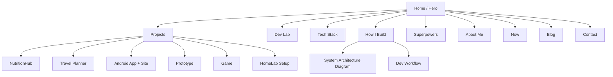

## 🧩 COMPLETE 10x-LEVEL PORTFOLIO STRUCTURE

### 🏠 1. **Landing / Hero Section**

**Goal:** Instantly communicates who you are and why you’re impressive.
Includes:

* Big, clean title:
  **“Kenta Waibel — Developer, Builder, and Problem Solver.”**
* Short tagline:

  > “I build full-stack apps, automate systems, and design experiences that connect technology with creativity.”
* A professional photo or minimal avatar.
* 2 buttons:
  🔗 *View My Work* → scrolls to Projects
  💬 *Get in Touch* → Contact section

Optionally: small text showing your current focus, e.g.

> “Currently building: NutritionHub — a modern nutrition PWA using Supabase.”

---

### 💻 2. **Highlighted Projects**

**Goal:** Show *depth and diversity*.
Structure:
Each project card links to a dedicated case-study page with:

* **Summary:** what the app does & why you built it
* **Your role & responsibilities**
* **Challenges & how you solved them**
* **Tech stack (icons + labels)**
* **Demo link + GitHub repo**
* **Short video or GIF**

Projects to feature:

1. 🥗 **NutritionHub (current)** — full-stack PWA with Supabase & Next.js
2. 🧭 **Travel Planner** — offline-ready PWA
3. 📱 **Android App + Marketing Site** — mobile + web integration
4. 🧠 **Prototype App** — the foundation of your nutrition project
5. 🎮 **Game (in progress)** — creativity + engine work
6. ⚙️ **HomeLab / Automation Setup** — Docker, Traefik, monitoring

(Keep 3–6 visible; others can go in “Dev Lab” section.)

---

### 🧪 3. **Dev Lab / Playground**

**Goal:** Demonstrate curiosity and ongoing learning.
Small cards for experimental stuff like:

* Docker setups
* Traefik routing experiment
* AI chatbot
* Unity prototype
* Game dev tests

Make it casual:

> “A space where I break things to learn how they work.”

---

### 🧠 4. **Tech Stack**

**Goal:** Show range without overwhelming.
Split into categories:

**Core Skills**

> Next.js, React, TypeScript, Supabase, Tailwind, Docker, Git

**Used in Projects**

> Kubernetes, Prometheus, Grafana, Traefik, Unity, Swift, Python, Java

**DevOps & Cloud**

> AWS, Azure, Vercel, Railway, Oracle Cloud, Portainer

**Bonus**

> Linux, macOS, Windows, Cursor IDE, Windsurf IDE, IntelliJ, VSCode, ChatGPT, REST APIs, Prisma, SSO integrations

✅ Optional: Add interactive hover-cards that show which project each tech was used in.

---

### ⚙️ 5. **How I Build**

**Goal:** Show systems thinking — this is where “10x” shines.
Explain your process clearly:

* How you design your architecture
* How you containerize and deploy
* How you monitor and improve uptime

You can show it with a **system diagram** (e.g., NutritionHub architecture):

```
Frontend (Next.js)
   ↓
API (Supabase)
   ↓
Database
   ↓
Dockerized backend
   ↓
Traefik → Domain (kewa.dev)
   ↓
Monitoring (Grafana + Prometheus)
```

Also add your dev flow:

> “I build fast prototypes locally with Docker Compose, push to GitHub, run CI/CD via Vercel or Railway, and monitor containers with Portainer.”

---

### 🧩 6. **Developer Superpowers**

Short, bold section that summarizes your edge:

> * 💡 End-to-end builder — from concept to deployment
> * 🧰 Full-stack generalist — web, mobile, backend, and infra
> * ⚡ Automation-driven — Docker, Kubernetes, CI/CD
> * 🧠 Always learning — experimenter by nature
> * 🎮 Creative thinker — game dev + UX mindset

This section should *feel like a brag sheet but read humbly.*

---

### 👤 7. **About Me**

Make it authentic, not corporate.

> “I’m an 18-year-old developer apprentice based in Zurich. I love building apps that combine practicality and creativity — from PWAs to full-stack platforms and games. I’m currently completing my apprenticeship (graduating July 2025) and exploring opportunities to keep building and learning.”

Include your photo, location, and link to CV.

---

### 📈 8. **Now Page**

Live section showing your current focus:

> “Currently working on NutritionHub and a Unity horror game. Learning advanced Supabase functions and experimenting with Framer Motion.”

---

### ✉️ 9. **Contact / Footer**

Include:

* Email
* GitHub
* LinkedIn
* Link to your domain (kewa.dev)
* Optional: Contact form

---

### 📰 10. **(Optional) Blog**

Add short, insightful posts:

* “How I use Docker + Traefik for my projects”
* “Lessons from building a Nutrition PWA”
* “Balancing creativity and structure in dev work”

One or two solid articles can make you look *really mature professionally.*

---

## 🧱 DESIGN GOALS

* **Framework:** Next.js + Tailwind
* **Layout:** Minimal, bright, and fast
* **Components:** Animated cards (Framer Motion), subtle gradients
* **Dark/light mode**
* **Performance-focused** (Lighthouse 90+)
* **Typography:** readable sans-serif (Inter or Geist)
* **Animations:** small transitions — not distractions

---

## 🗺️ MERMAID DIAGRAM — SITE STRUCTURE

Here’s the full flow of your portfolio:




